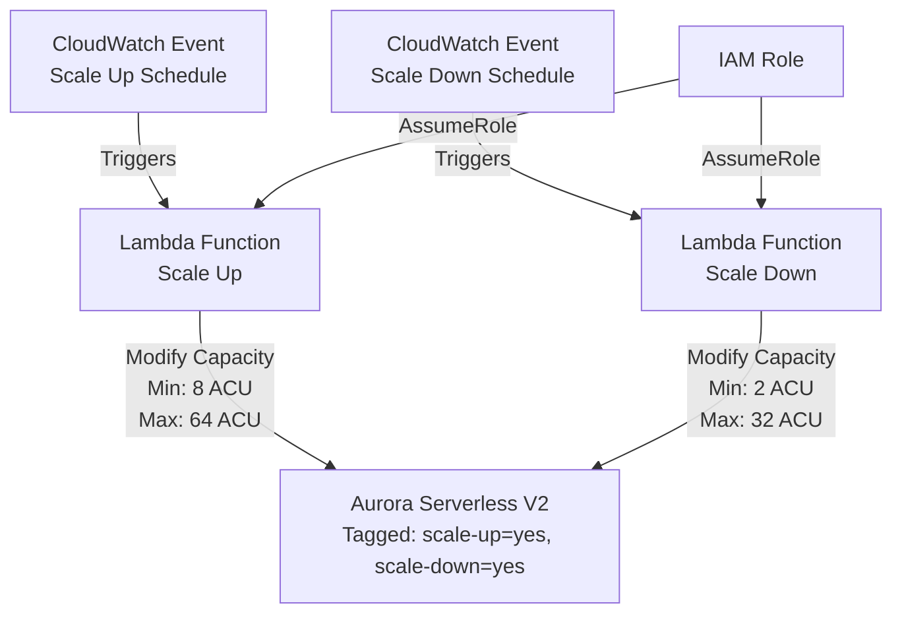
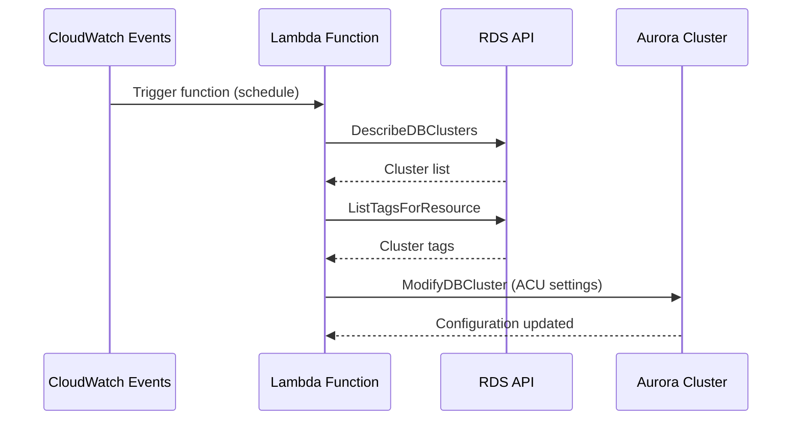

# Aurora Serverless V2 Automation

This AWS CloudFormation stack automates the scaling up and scaling down of Amazon Aurora Serverless V2 databases. It leverages AWS Lambda functions triggered by Amazon CloudWatch Events based on defined schedules to adjust the Aurora Serverless V2 minimum and maximum ACUs (Aurora Capacity Units), optimizing performance and cost.

## Description

The stack manages the following resources:
- **Lambda Functions**: Two Lambda functions are created, one for scaling up the Aurora Serverless V2 cluster in the morning and another for scaling it down in the evening.
- **IAM Role**: An execution role for the Lambda functions with necessary permissions.
- **CloudWatch Event Rules**: Two rules that trigger the Lambda functions according to the defined cron expressions for scaling up and down.

## Architecture

The solution follows a serverless event-driven architecture to automatically manage Aurora Serverless V2 capacity:

## Sequence Diagrams

## Parameters

- `ScaleUpScheduleExpression`: Cron expression for the scale up schedule (Default: `cron(0 5 * * ? *)` for 5:00 AM UTC).
- `ScaleDownScheduleExpression`: Cron expression for the scale down schedule (Default: `cron(0 23 * * ? *)` for 11:00 PM UTC).
- `ScaleUpMinACU`: Minimum ACU to set for scaling up (Default: 8).
- `ScaleUpMaxACU`: Maximum ACU to set for scaling up (Default: 64).
- `ScaleDownMinACU`: Minimum ACU to set for scaling down (Default: 2).
- `ScaleDownMaxACU`: Maximum ACU to set for scaling down (Default: 32).

## Deployment

To deploy this stack:
1. Navigate to the AWS CloudFormation Console.
2. Click on "Create Stack" > With new resources (standard).
3. Upload the provided CloudFormation template file or paste the template content into the template editor.
4. Provide the necessary parameters adjustment according to your Aurora Serverless V2 cluster requirements.
5. Review and create the stack.

## Operation

Once deployed, the Lambda functions will automatically adjust the ACUs of your Aurora Serverless V2 clusters based on the tags:
- For scaling up: Looks for clusters with the tag `scale-up=yes`.
- For scaling down: Looks for clusters with the tag `scale-down=yes`.

Ensure your Aurora Serverless V2 clusters are tagged accordingly for the automation to apply.

## Customization

You can customize the schedule and ACU settings by updating the CloudFormation stack and modifying the parameters as needed. This allows for flexibility in managing your Aurora Serverless V2 clusters' performance and cost optimization strategies.
